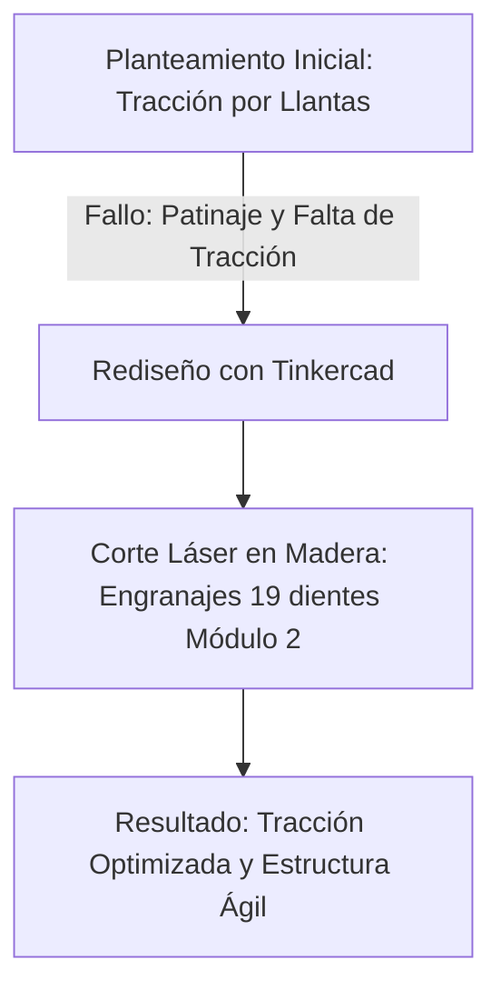
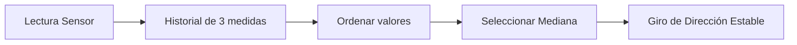

# MEMORIA WRO 2026
**Future Engineers - Coche Autónomo**  
**Enlace a GitHub:** [github.com/farc0001/TecnoAlarcos](https://github.com/farc0001/TecnoAlarcos)

---

## Índice
1. [Movilidad y diseño mecánico](#1-movilidad-y-diseño-mecánico)
2. [Arquitectura de potencia y sensores](#2-arquitectura-de-potencia-y-sensores)
3. [Arquitectura de software y estrategia](#3-arquitectura-de-software-y-estrategia)
4. [Errores y soluciones](#4-errores-y-soluciones)
5. [Pensamiento sistémico y decisiones de ingeniería](#5-pensamiento-sistémico-y-decisiones-de-ingeniería)
6. [Reproducibilidad y calidad GitHub](#6-reproducibilidad-y-calidad-github)

---

## 1. Movilidad y diseño mecánico

El coche está diseñado en **tracción trasera** mediante el uso de un servo de movimiento unido con dos engranajes de 19 dientes módulo 2 (diseñados con Tinkercad) al eje trasero de movimiento del coche. Para hacer estos engranajes usamos madera y una cortadora láser, lo que nos dio muy buena tracción y quedó bastante bien con el resto del chasis.

La **dirección delantera** se mueve gracias a un servo de dirección unido mediante varias barras de madera (palos de polos de helado) con tornillos y tuercas a dos piezas móviles unidas a dos ruedas con ejes independientes. Este diseño es similar a la *dirección Ackermann* empleada en automóviles.

Nuestro diseño ofrece una simplicidad estructural que permite rápidos arreglos físicos en caso de fallo, también ofrece un peso reducido que le permite ser mucho más ágil. El chasis en sí es una placa de contrachapado cortada a medidas, en la que usamos también silicona, bridas y tornillería para unirlo todo.

### Problemas encontrados y evolución
Encontramos problemas dentro del chasis como la colocación de nuestro servomotor, siendo consecuente de esto que no hubiera tracción entre nuestras dos llantas. Por eso cambiamos a los engranajes de madera hechos a medida. De hecho, realizamos varias pruebas de movilidad en el tatami entre las que incluimos pruebas de velocidad, de agilidad y de sensores, y al principio todas desembocaron en un fracaso, pero nos sirvió para darnos cuenta de estos fallos.



---
Todas las piezas han sido realizadas en contrachapado de 3mm de grosor y cortadas con la SculpFun S30 con láser de diodo de 5W, potencia al 100%, velocidad de corte de 80mm/min y una pasada.

## 2. Arquitectura de potencia y sensores

Algunos de los componentes que utiliza nuestro robot como fuente de alimentación eran inicialmente pilas de AAA y AA. La micro:bit y nuestros sensores se alimentaban a partir de estas pilas. Utilizamos dos sensores ultrasonido y un servomotor de tracción, una HuskyLens como cámara y el servo de dirección. Todos nuestros componentes están colocados específicamente pensados a base del diseño de nuestra placa de contrachapado.

### Problemas con la alimentación y las pilas
Al principio usábamos pilas normales, pero notamos que cuando el motor arrancaba de golpe o la cámara procesaba mucho, a veces la placa se reiniciaba por falta de energía. Para arreglar esto, pasamos a usar una **batería recargable de Litio (Li-ion) de 3.7V y 5200mAh** con un conector especial. Ahora el robot tiene energía constante y no se apaga a mitad de la pista.

### Calibración y problemas con los pines
La calibración de nuestros sensores fue realmente sencilla ya que solo era determinarles un pin y respetar los pines elegidos durante la creación del código. La calibración de los colores fue a partir de la cámara en donde te deja reconocer los colores e ir calibrando con un poco de tiempo cada color mediante diversos ángulos.

Sin embargo, sí tuvimos un problema raro: el coche a veces se encendía solo. Nos dimos cuenta de que estábamos usando pines para los ultrasonidos que la micro:bit usa internamente para sus propios LEDs y para el botón A. Así que cambiamos los cables a otros pines para que no chocaran entre sí.

### Asignación de Pines Definitiva

| Componente | Pin Asignado | Función / Protocolo |
| :--- | :---: | :--- |
| **Motor de Tracción** | `P0` | Control de velocidad trasero |
| **Servo de Dirección** | `P2` | Ángulo de giro (Ackermann) |
| **Ultrasonido Derecho (Echo)** | `P1` | Receptor eco derecho |
| **Ultrasonido Derecho (Trig)** | `P16` | Disparador ultrasonido derecho |
| **Ultrasonido Izquierdo (Echo)** | `P8` | Receptor eco izquierdo |
| **Ultrasonido Izquierdo (Trig)** | `P12` | Disparador ultrasonido izquierdo |
| **HuskyLens (Cámara)** | `P19 / P20` | Comunicación I2C para visión artificial |

---

## 3. Arquitectura de software y estrategia

El robot emplea una **micro:bit** como microcontrolador junto a una placa de expansión de microlog la cual se encargará de conectar la micro:bit a los sensores de ultrasonidos y los servos. Para el código hemos utilizado la plataforma de **MakeCode con JavaScript/TypeScript** ya que cuenta con algunas ventajas por encima de usar bloques:
* Mayor capacidad a la hora de operar con arrays.
* Mejor control de errores.
* Un mejor manejo a la hora de modificar el código en aspectos como la disposición visual (el editor de JavaScript permite una lectura lineal del código mientras que en el editor de bloques el orden puede volverse caótico).

### Fase previa y arranque
El funcionamiento del robot sigue un flujo lógico secuencial: al iniciar la placa de expansión se activan la micro:bit y la conexión de esta con la HuskyLens. Después, para que el programa empiece a funcionar hay que accionar el **botón "A"** de la micro:bit, el cual cambiará el valor de una variable dentro del programa para empezar a realizar las comprobaciones previas que le dirán al microcontrolador el sentido y la modalidad:

1. **Sentido de giro:** Para detectar en qué sentido tiene que girar el robot al apretar el botón "A" el coche no se moverá inmediatamente; lo primero que hará será medir la distancia entre el sensor izquierdo y derecho. Gracias a las paredes del circuito, con estas medidas se puede determinar la orientación del robot en la salida. Si el sensor izquierdo reporta un valor más pequeño que el derecho, el robot determina que debe ir en **sentido horario**.
2. **Open u Obstacle Challenge:** Utiliza una lógica muy sencilla: si el ID 1 (Magenta), ID 2 (Verde) o ID 3 (Rojo) son captados por la cámara, el sistema inicia en **Obstacle Challenge**; de lo contrario, arranca en **Open Challenge**.

### El Sistema de Corrección (PD)
En el *Obstacle Challenge* el robot evita obstáculos mediante la cámara, la cual le reporta a la micro:bit mediante una conexión I2C los IDs asociados al color del aparcamiento y de cada obstáculo, además de utilizar los ultrasonidos para mantenerse siempre que pueda centrado y saber cuándo tiene que girar.

El robot utiliza un sistema de corrección avanzado basado en un controlador **PD (Proporcional-Derivativo)**. En la robótica de alta velocidad, casi nunca se usa la "I" (Integral) debido al problema del *Integral Windup* (acumular errores pasados en un coche rápido provoca retraso en la reacción y colisiones contra la pared).

El algoritmo funciona en tres pasos dentro del modo de carrera:

1. **El Cálculo del Error:** Determina qué tan descentrado está el robot restando la lectura del sensor derecho de la del izquierdo:
   $$	ext{error3} = 	ext{dist\_der} - 	ext{dist\_izq} + 	ext{offset\_centro}$$
   * Si es `0`: El robot está perfectamente centrado.
   * Si es `positivo`: Está demasiado pegado a la pared izquierda.
   * Si es `negativo`: Está demasiado pegado a la pared derecha.
2. **La "P" (Proporcional) - Fuerza de giro ($K_P = 1.4$):** Multiplica el error por esta constante. Cuanto más lejos esté del centro, más fuerte girará. Para evitar el zig-zag infinito y violento que generaría usar solo este término a alta velocidad, se introduce el derivativo.
3. **La "D" (Derivativo) - Freno estabilizador ($K_D = 0.9$):** Mide la velocidad de aproximación al centro:
   $$	ext{derivativo} = 	ext{error3} - 	ext{error\_previo}$$
   Detecta si el coche se va a pasar de largo y actúa como una fuerza en contra, enderezando las ruedas antes de llegar al centro exacto para estabilizar el coche suavemente.

#### Fórmula de Corrección Final
El código junta estas dos fuerzas en una sola línea matemática que decide los grados exactos que debe girar el servo de dirección, limitando el valor máximo mediante una restricción para proteger la dirección física:

```typescript
// Código implementado en MakeCode JavaScript
let correccion = Math.constrain(error3 * KP + derivativo * KD, -CORR_MAX, CORR_MAX);
```

### Estrategias en pista
* **Curvas:** El robot sabe que hay una esquina cuando un sensor de ultrasonidos marca una distancia muy grande (porque se acaba la pared) y al mismo tiempo la brújula de la placa detecta que hemos girado bastante.
* **Obstáculos:** Cuando la cámara ve un pilar rojo o verde que es muy grande (lo que significa que está cerca), le suma temporalmente un número al centro del robot (`offset_centro`) para que el código PD lo desvíe hacia un lado suavemente.
* **Frenado:** Cuando terminamos las vueltas y entramos en la fase de parking, el robot busca el color Magenta. Al verlo cerca, gira hacia él y apaga el motor de tracción para pararse.

---

## 4. Errores y soluciones

* **Reconocimiento de colores:** Los únicos problemas de lectura encontrados inicialmente correspondieron al reconocimiento y calibración de colores a través de la cámara, solucionados tras ajustar los ángulos y tiempos de exposición.
* **Conflicto de Tipos en JavaScript:** Surgió un error que bloqueaba el programa al intentar operar aritméticamente sobre una variable booleana:
  ```antipattern
  // ERROR: Inicializar como booleano e intentar sumar valores numéricos
  let estado = false; 
  estado = estado + 2; // Bloqueo del programa
  ```
  *Solución:* Se corrigió el tipado asegurando desde la inicialización que la variable guardara explícitamente valores numéricos.
* **Picos de Ruido en Ultrasonidos:** Los sensores daban lecturas erróneas extremas de forma aleatoria, provocando volantazos bruscos.
  *Solución:* Se implementó un **filtro de mediana**. El código guarda las 3 últimas medidas del ultrasonido y escoge el valor intermedio, ignorando con éxito los picos de ruido.



---

## 5. Pensamiento sistémico y decisiones de ingeniería

Durante el proceso de la construcción de nuestro coche autónomo, identificamos y gestionamos las siguientes limitaciones:
* **El tiempo:** Dificultad para reunir al equipo debido a actividades académicas y personales individuales. Se optimizó el flujo de trabajo limitando las reuniones a sesiones de **5 horas a la semana**.
* **El presupuesto:** Trabajamos de forma adaptativa utilizando los materiales proporcionados por el Instituto, lo cual limitó el hardware disponible pero estimuló la optimización del diseño.

A lo largo del proyecto se descartaron diversos modelos de chasis y algoritmos de programación en base a pruebas empíricas. Las mejoras más notables incluyeron la transición del acoplamiento por fricción directa entre llantas hacia el **módulo de engranajes de madera personalizados**, junto con una refactorización lineal del código para asegurar un rendimiento óptimo de los hilos de ejecución y las variables.

---

## 6. Reproducibilidad y calidad GitHub

Todo nuestro proyecto se encuentra documentado y estructurado con acceso público para garantizar su reproducibilidad:

* **Repositorio oficial:** [github.com/farc0001/TecnoAlarcos](https://github.com/farc0001/TecnoAlarcos)
* **Contenido disponible:** Código fuente en JavaScript estructurado de manera lineal, documentación base (`README.md`), esquemas de arquitectura y los archivos vectoriales empleados para el corte láser de los engranajes. El historial del repositorio refleja de manera transparente las pruebas realizadas hasta la obtención de la versión de competición.
