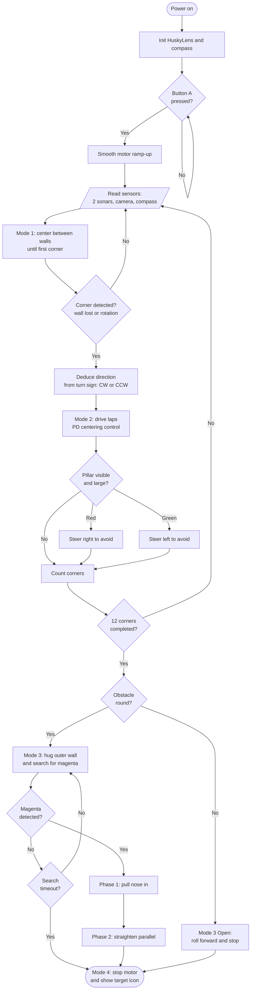

# CONCURSOS DE ROBÓTICA DE LA UCLM

# WRO 2026 Future Engineers - Autonomous Vehicle Documentation - I.E.S. Santa María de Alarcos (Ciudad Real, Spain)

This repository contains the official documentation, source code, and mechanical design overview of our autonomous vehicle engineered for the **Future Engineers** category of the World Robot Olympiad (WRO). 

Our engineering approach focuses on a lightweight mechanical design, an interference-free hardware architecture, and a dynamic Proportional-Derivative (PD) control algorithm written in TypeScript via the MakeCode platform.

---

## Table of Contents

1. [Mechanical Design and Mobility](#1-mechanical-design-and-mobility)
2. [Power Architecture, Electronics, and Sensors](#2-power-architecture-electronics-and-sensors)
3. [Software Architecture and Strategy](#3-software-architecture-and-strategy)
4. [Systemic Thinking and Engineering Decisions](#4-systemic-thinking-and-engineering-decisions)

---

## 1. Mechanical Design and Mobility

The chassis is built upon a custom-cut plywood board. This material choice provides structural simplicity, a low overall weight, and high agility on the track. Furthermore, the modular nature of the design allows for rapid physical repairs in the event of hardware failure or collisions during a race.

* **Rear-Wheel Drive Transmission:** We utilize a continuous rotation servo coupled to the rear axle via two custom-designed 19-tooth (modulus 2) gears. These gears were modeled in Tinkercad and 3D printed. This direct-gear transmission solved early traction issues, eliminating the wheel slip experienced in our initial friction-based prototypes.
* **Front Steering Mechanism:** The steering system is based on **Ackermann steering geometry**. It operates using a standard positional servo connected via plastic tie rods, nuts, and bolts to two movable steering knuckles with independent axles for each front wheel.
* **Supplementary Materials:** Plastic sheets for steering linkages, structural silicone, zip ties, and standard mounting hardware.

---
All pieces have been cut with a SculpFun S30 with a 5W diode laser at 100% power and a cutting speed of 80mm/min and air assistance. 
Folder V4

|         RIGHT         |           FRONT            |             LEFT            |          REAR             |
| --------------------- | -------------------------- | --------------------------- | ------------------------- |
|  |  |  |  |

|                       |            UP              |                             |                           |
| --------------------- | -------------------------- | --------------------------- | ------------------------- |
|  |  |  |  |

## 2. Power Architecture, Electronics, and Sensors

The central processing unit of the robot is a **BBC micro:bit** mounted on a Microlog expansion board. The entire system, including the microcontroller, motors, and sensors, is powered by an independent AA and AAA battery bank or alternatively a power bank to ensure stable current draw during motor acceleration.

For environmental perception, the vehicle utilizes:
* **Ultrasonic Sensors (x2):** Mounted on the left and right sides to measure wall distances (HC-SR04 module).
* **HuskyLens AI Vision Sensor:** Communicating via I2C to handle real-time color and object recognition (pillars and parking zones).

### Optimized Hardware Pinout
During hardware integration, we identified severe signal interference. The micro:bit's internal LED matrix and the onboard buttons share physical pins with external GPIOs. Using these shared pins for sensors caused "ghost starts" (unprompted hardware interrupts) and erratic ultrasonic readings. We re-routed the hardware to guarantee zero conflicts:

| Component | Assigned Pin | Engineering Notes |
| :--- | :--- | :--- |
| Traction Motor (Servo) | P0 | Primary speed control |
| Steering Motor (Servo) | P2 | Angle control (Ackermann linkage) |
| Right Ultrasonic (Echo) | P1 | Re-routed to avoid P5 (Button A interference) |
| Right Ultrasonic (Trig) | P16 | Dedicated trigger line |
| Left Ultrasonic (Echo) | P8 | Completely isolated from internal LED matrix |
| Left Ultrasonic (Trig) | P12 | Completely isolated from internal LED matrix |
| HuskyLens Camera | P19 / P20 | Standard I2C communication lines |

---

## 3. Software Architecture and Strategy

The main execution loop is developed in **JavaScript/TypeScript** using MakeCode. Text-based programming was selected over block-based programming due to its superior handling of arrays (used for median filtering of sensor data), better error control, and the ability to maintain a clean, linear, and highly readable codebase.

### State Machine Overview
The vehicle's behavior is organized as a finite state machine with four modes, traversed sequentially during a run. The flowchart below shows the full control flow, from the safe start sequence to the final parking maneuver. Most "No" branches return to the sensor-reading step, which is the beginning of each iteration of the main loop.

### Autonomous Pre-Start Logic
Upon powering the expansion board and pressing Button A, the vehicle does not move immediately. It executes a pre-flight environmental scan:
* **Track Direction Detection:** The robot measures the initial distance to the left and right walls. Based on the asymmetrical starting dimensions of the WRO track, the microcontroller mathematically deduces whether it must run the circuit clockwise or counter-clockwise.
* **Challenge Mode Detection:** The HuskyLens scans the immediate environment. If it detects active specific color IDs (1: Magenta, 2: Green, 3: Red), the software automatically enters *Obstacle Challenge* mode. If no colors are detected, it defaults to the *Open Challenge* mode.

### Centering Algorithm: PD Controller
In high-speed racing robotics, the "I" (Integral) component of a standard PID controller accumulates past errors, often causing delayed reactions and subsequent wall collisions (a phenomenon known as *Integral Windup*). Therefore, we implemented a highly tuned **Proportional-Derivative (PD) controller**.

* **Error Calculation:** The system determines its offset from the track's center by calculating the difference between the right and left ultrasonic sensors (`error3 = dist_der - dist_izq - offset_centro`).
* **Proportional (P):** The raw steering force. The further the robot is from the center line, the sharper the steering angle applied (`KP = 1.4`).
* **Derivative (D):** The dampening force. To prevent infinite oscillation (zig-zagging), the derivative calculates the rate of approach to the center. It counter-steers slightly before reaching the exact center to ensure smooth stabilization (`KD = 0.9`).

The final mathematical correction sent to the steering servo is constrained by mechanical safety limits:
`correccion = Math.constrain(error3 * KP + derivativo * KD, 0 - CORR_MAX, CORR_MAX)`

### Navigation Strategies
* **Cornering:** The algorithm detects a corner when the ultrasonic sensors report a sudden loss of the outer wall (distance exceeds a set threshold) AND the micro:bit's internal magnetometer registers an accumulated heading rotation exceeding a specific angular threshold.
* **Obstacle Avoidance:** The HuskyLens continuously reports the ID and the bounding box width of detected colors. If the bounding box of a red or green pillar exceeds a predetermined size (indicating proximity), the software temporarily injects an `offset_centro` value into the PD controller, forcing the robot to fluidly shift to the safe lane.
* **Braking and Parking:** After completing the required laps, the system actively searches for the Magenta color (ID 1). Once the bounding box width confirms it is within range, the vehicle triggers a sequence to steer into the parking zone and cuts power to the traction motor.
* **Trajectory Correction:** Sensor data is read, filtered through a mathematical median array to discard anomalous noise, and processed by the PD controller seamlessly at 50Hz.

---

## 4. Systemic Thinking and Engineering Decisions

The development of this autonomous vehicle required a systemic approach to balance technical requirements against real-world constraints:

* **Time and Budget Constraints:** The team was limited to 5 working hours per week and utilized standard materials provided by our institution. We adapted our mechanical design to maximize the structural integrity of readily available components (plywood, silicone).
* **Traction Dynamics:** Initial tests on the WRO tatami mat were unsuccessful due to poor speed and agility caused by direct-axle wheel slip. *Solution:* We adopted an iterative design process, upgrading to a custom 3D-printed gear transmission system to increase torque and grip.
* **Sensor Interference and Hardware Bugs:** We experienced critical failures where the car would start on its own or fail to read distances. *Solution:* Through deep hardware documentation research, we mapped the micro:bit's internal architecture and migrated the ultrasonic pins away from the shared LED matrix and Button A lines.
* **Machine Vision Calibration:** Reliable color recognition in motion proved highly unstable due to changing lighting conditions. *Solution:* We dedicated specific tuning sessions solely to train the HuskyLens algorithm under various angles, distances, and lighting environments to achieve a stable bounding-box read.
